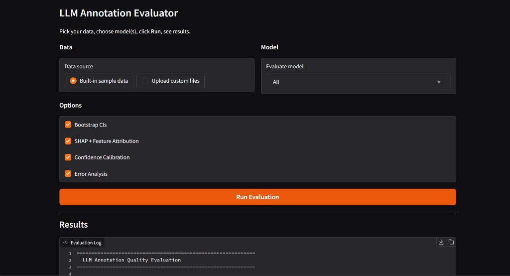
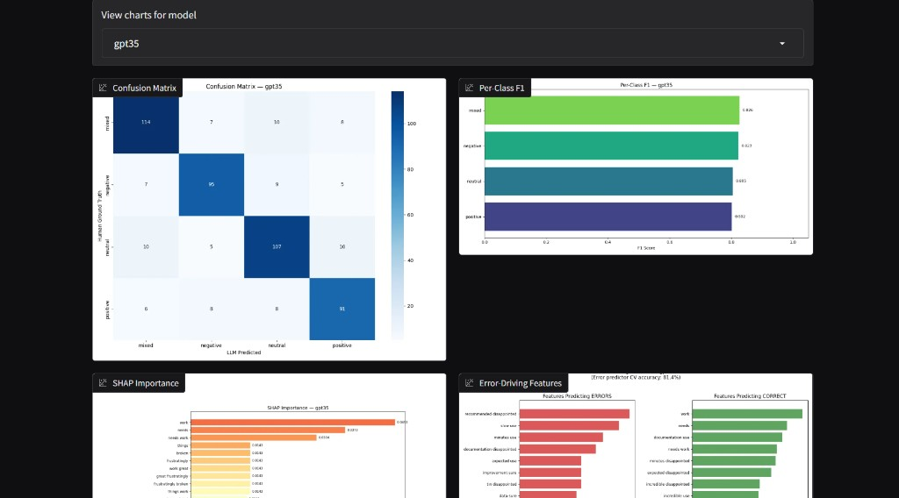
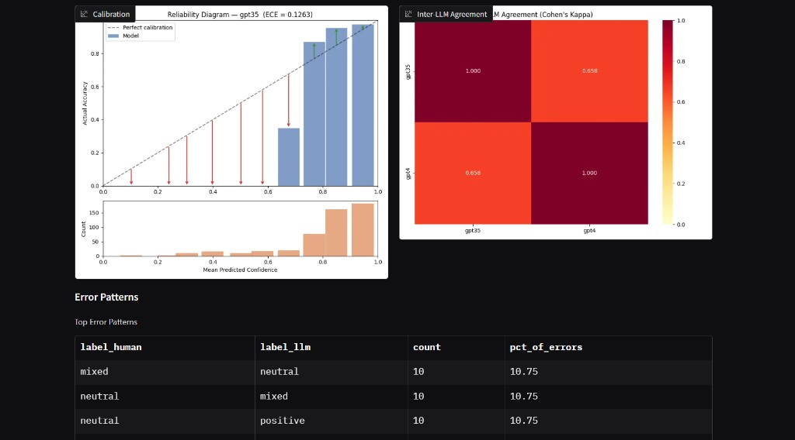
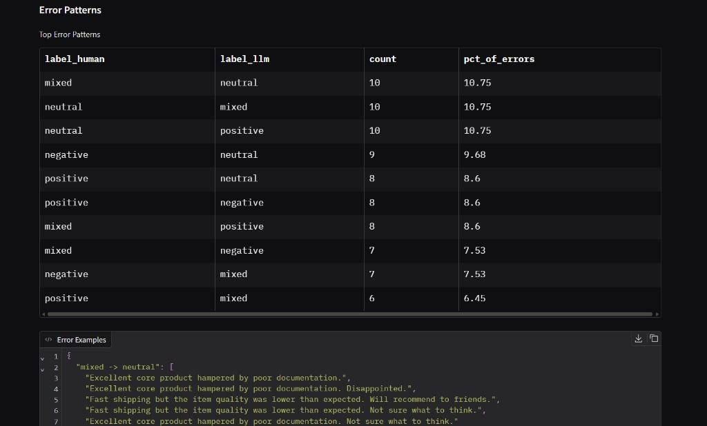

# LLM Annotation Quality Evaluation Framework

Evaluate the quality of LLM-generated annotations against human-labelled baselines.

## Screenshots

Gradio dashboard (`python app.py`): configure data and models, run evaluation, and explore reports in the browser.

### Main UI

Pick **sample data** or **upload** your own, choose which model(s) to evaluate, toggle **Bootstrap**, **SHAP**, **calibration**, and **error analysis**, then **Run Evaluation**.



### Metrics & explainability

Per-model **confusion matrix**, **per-class F1**, **SHAP feature importance**, and **error-driving features** (with CV accuracy for the error predictor).



### Calibration & inter-model agreement

**Reliability diagram** (calibration / ECE), **inter-LLM agreement** (Cohen’s κ heatmap), and **top error patterns** vs human labels.



### Error patterns & examples

**Top mismatch patterns** (`label_human` → `label_llm`) and **sample texts** for each pattern to debug systematic failures.



## Features

- **Classification metrics** — Precision, Recall, F1, Cohen's Kappa, Krippendorff's Alpha
- **Sequence labeling** — Entity-level evaluation via seqeval (NER, POS tagging)
- **Soft scoring** — Partial-credit IoU for overlapping spans
- **Bootstrap CIs** — Confidence intervals on all metrics
- **Slice-based evaluation** — Metrics by text length, domain, complexity
- **Error analysis** — Systematic mismatch pattern detection with examples
- **Inter-LLM agreement** — Pairwise kappa between multiple models
- **Visual reports** — Confusion matrices, per-class F1 charts, agreement heatmaps

## Quick Start

```bash
# 1. Install dependencies
pip install -r requirements.txt

# 2. Generate sample data (500 synthetic samples)
python generate_sample_data.py

# 3. Run the evaluation (CLI)
python main.py --config config/eval_config.yaml

# 4. View reports
ls reports/

# Optional: interactive Gradio dashboard (see Screenshots above)
python app.py
```

## Project Structure

```
llm-annotation-eval/
├── config/
│   └── eval_config.yaml          # Evaluation configuration
├── data/
│   ├── loaders.py                # Load human + LLM annotations (JSONL/CSV/JSON)
│   └── alignment.py              # Format normalization & validation
├── metrics/
│   ├── classification.py         # Precision, Recall, F1, Kappa, Krippendorff
│   ├── sequence_labeling.py      # Token-level NER metrics (seqeval)
│   └── advanced.py               # Soft scoring, inter-LLM agreement
├── analysis/
│   ├── bootstrap.py              # Confidence intervals via bootstrap
│   ├── slicing.py                # Subset / slice-based evaluation
│   └── error_analysis.py         # Systematic error detection
├── reporting/
│   ├── tables.py                 # Summary tables (CSV/JSON)
│   ├── visualizations.py         # Confusion matrices, bar charts, heatmaps
│   └── trends.py                 # Multi-model version tracking
├── sample_data/                  # Generated test data
├── docs/images/                  # README screenshots
├── main.py                       # CLI entrypoint
├── app.py                        # Gradio dashboard
├── generate_sample_data.py       # Synthetic data generator
└── requirements.txt
```

## Configuration

Edit `config/eval_config.yaml` to specify:

| Key | Description |
|-----|-------------|
| `task_type` | `classification`, `ner`, or `sentiment` |
| `dataset.human_labels` | Path to human annotation file |
| `dataset.llm_labels` | Dict of model_name → annotation file |
| `metrics.*` | Toggle individual metrics on/off |
| `reliability.bootstrap` | Enable bootstrap confidence intervals |
| `slicing.fields` | Define data slices for subset analysis |
| `advanced.error_analysis` | Enable systematic error detection |

## Data Format

Annotation files use **JSONL** (one JSON object per line):

```json
{"sample_id": "sample_00001", "text": "Great product!", "label": "positive", "domain": "retail"}
{"sample_id": "sample_00002", "text": "Terrible service.", "label": "negative", "domain": "support"}
```

## Output

Reports are saved to the `reports/` directory:

- `summary.csv` / `summary.json` — Metrics per model
- `full_results.json` — Complete metric breakdown
- `<model>/confusion_matrix.png` — Confusion matrix heatmap
- `<model>/per_class_f1.png` — Per-class F1 bar chart
- `<model>/error_patterns.csv` — Top mismatch patterns
- `<model>/error_examples.json` — Sampled error texts
- `inter_llm_agreement.json` / `.png` — Pairwise model agreement

## Using Your Own Data

1. Prepare your human annotations and LLM outputs as JSONL files
2. Update `config/eval_config.yaml` with your file paths
3. Run `python main.py --config config/eval_config.yaml`

## Extending

- Add new metrics in `metrics/` and register them in the config
- Add new visualizations in `reporting/visualizations.py`
- For NER tasks, use `metrics/sequence_labeling.py` directly
